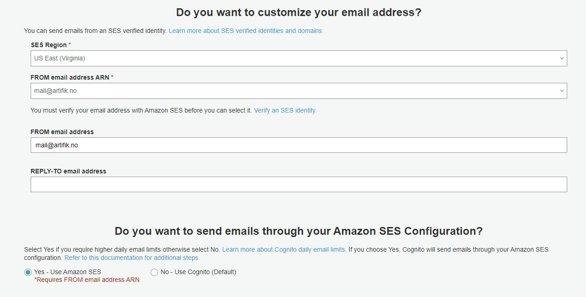
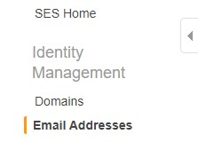
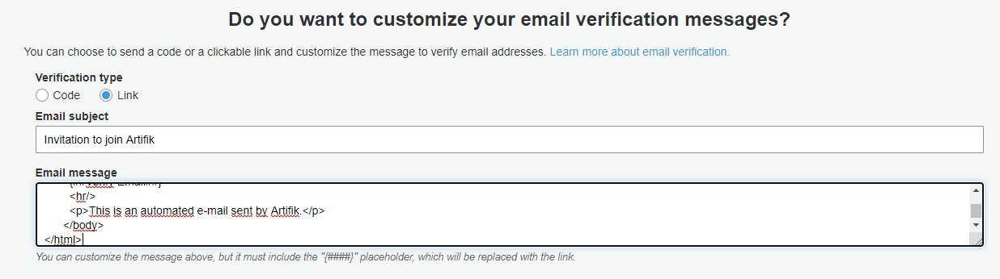
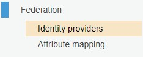
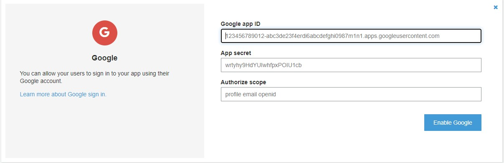
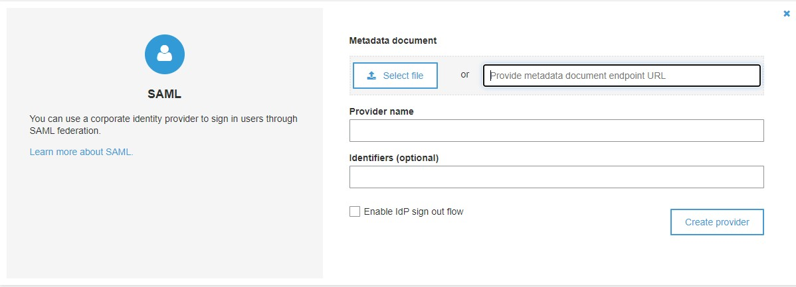
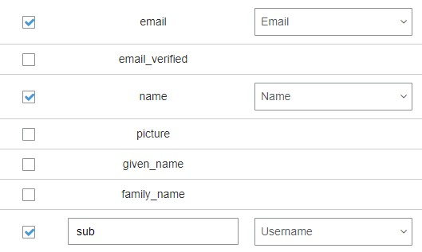
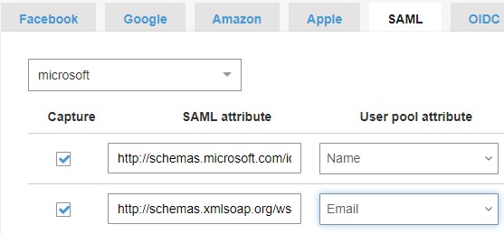

## Authentication with Cognito User Pool

In this aplication we are using cognito as the user pool for authentication, and the authorization it's been handled by us within our lambdas trought a custom rol system implemented specifically for the bussiness.

Before start it's important to note a few notes:

- For the custom email sending we are going to configure it trought the console because the cognito cdk module doesn't support AWS SES yet. but if you want implement it in with cdk you can use cognito layer 1 modules

- We are securing our API authenticating from the cognito user pool INSIDE OUR LAMBDAS, that mean that we implemented our custom logic to Authenticate users, however we recomend you to let ApiGw leverage this authentication like is showen in [this link](https://docs.aws.amazon.com/apigateway/latest/developerguide/apigateway-cross-account-cognito-authorizer.html).

now lets start.

first install the cognito module and import it

`$ npm i -s @aws-cdk/aws-cognito@1.66.0`

_lib/sample_serverless-stack.ts_

```javascript
import {
  OAuthScope,
  UserPool,
  UserPoolClientIdentityProvider,
  UserPoolOperation,
} from '@aws-cdk/aws-cognito';
```

now we create our user pool

```javascript
const pool = new UserPool(this, 'MyUserPool', {
  userPoolName: 'pool',
  selfSignUpEnabled: true,
  signInCaseSensitive: false,
  signInAliases: {
    username: true,
    email: true,
  },
  standardAttributes: {
    email: {
      required: true,
      mutable: true,
    },
    fullname: {
      required: true,
      mutable: true,
    },
  },
});
```

we are enabling users to selfsignup and then with the lambda triggers we are validating who really is allowed to signup in the user pool. the rest of the configuration its' pretty standard and self explainatory.

Now we are going to add the domain and two cognito clients.

```javascript
// Domain
pool.addDomain('MyCognitoDomain', {
  cognitoDomain: {
    domainPrefix: 'client',
  },
});

// Clients
pool.addClient('MyLocalClient', {
  userPoolClientName: 'client-local',
  generateSecret: false,
  preventUserExistenceErrors: true,
  oAuth: {
    flows: {
      authorizationCodeGrant: true,
    },
    scopes: [OAuthScope.OPENID, OAuthScope.COGNITO_ADMIN],
    callbackUrls: ['http://localhost:3000/'],
    logoutUrls: ['http://localhost:3000/'],
  },
  supportedIdentityProviders: [UserPoolClientIdentityProvider.COGNITO],
});

pool.addClient('MyProdClient', {
  userPoolClientName: 'client-prod',
  generateSecret: false,
  preventUserExistenceErrors: true,
  oAuth: {
    flows: {
      authorizationCodeGrant: true,
    },
    scopes: [OAuthScope.OPENID, OAuthScope.COGNITO_ADMIN],
    callbackUrls: ['https://url.com/'],
    logoutUrls: ['https://url.com/'],
  },
  supportedIdentityProviders: [UserPoolClientIdentityProvider.COGNITO],
});
```

The clients are what allow us to authenticate with the user pool and get the tokens for accessing our API. here we created 2 clients that are going to be used in the React application. the local environment and the S3 static web hosted app environment.

Also we created a domain that is what we are going to use to enable the Google and Microsoft Idp's.

Before end with the cdk and pass to the console, we are going to add the triggers

```javascript
const postTrigger = new Function(this, 'MyCognitoPostTrigger', {
  runtime: Runtime.NODEJS_10_X,
  handler: 'cognito.postConfirmation',
  code: Code.fromAsset('lambda'),
});
const preTrigger = new Function(this, 'MyCognitoPreTrigger', {
  runtime: Runtime.NODEJS_10_X,
  handler: 'cognito.preSignUp',
  code: Code.fromAsset('lambda'),
});
pool.addTrigger(UserPoolOperation.POST_CONFIRMATION, postTrigger);
pool.addTrigger(UserPoolOperation.PRE_SIGN_UP, preTrigger);
```

we are using two triggers according to our custom authentication flow.

- the preSignUp is verifying if the user email it's allowed to create a cognito user within our pool.
- the postConfirmation is to create the cognito user in our RDS database.

the _cognito.js_ its empty for this demo, but we are going to put some logic there in a future when we add all the project.

Now it's time to deploy the code and move to the console to enable the custom email verification and the External Idp's

`$ npm run build; cdk deploy`

## Customize your email verification address and message

Go to the _Message customizations_ tab in the AWS Cognito panel and enter the email that you want to use for send the cognito messages



**If you are using the SES Sandbox mode you must go to the SES console and enable the email that you are going to use**



In the same _Message customizations_ tab you also have some felds to add your custom message for email verification-



## Enable Google & Microsoft AD identity providers

**This part requires that you previosly enabled the OAuth 2.0 for your cognito user pool from Google API Console and Microsoft Azure Console**

1. Google [tutorial]()
2. Microsoft [tutorial](https://www.youtube.com/watch?v=QHoOChLVv_k&ab_channel=AWSFull-Stack)

Go to the "Identity providers" tab in your AWS Cognito console



Click on the google option and add the keys that you get from the google api

- Google app ID: 585127161914-4a74c1gks98av78js3kjpg53nqrp7hrn.apps.googleusercontent.com
- App secret: bRbdl8SuUV9yae6Czm9DOsw-
- Authorize scope: profile email openid



for microsoft click on the SAML option and insert the metadata document getted from the azure console. choose a provider name and click on "create provider"

- Metadata document: https://login.microsoftonline.com/99f7b55e-9cbe-467b-8143-919782918afb/federationmetadata/2007-06/federationmetadata.xml



Now we have to configure the attributes that we are going to map from the external identity providers to our cognito user pool.

Click on the _Attribute mapping_ tab and map the next attributes from google.



_This is a very inportant step because our user pool was configured with required email and required name attributes, so if the google provider doesn't map those attributes the user will not be created_

Next for the microsoft mapping you click on the _SAML_ tab, select the provider that you created before, and then add the next two lines in order to map to Name and Email attributes respectively

```
http://schemas.microsoft.com/identity/claims/displayname
http://schemas.xmlsoap.org/ws/2005/05/identity/claims/name
```



And it's done! now the only thing that remainds its to replace the sample code with our real bussiness code.
