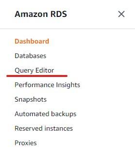
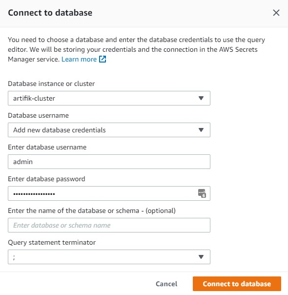
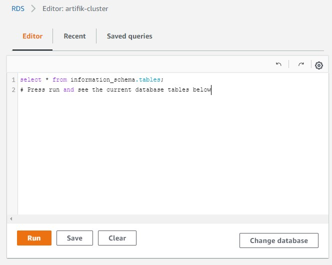

## Creating our Database with Aurora Serverless

First install the RDS module

`$ npm i -s @aws-cdk/aws-rds@1.66.0`

On _lib/sample_serverless-stack.ts_ import the module

```javascript
import {
  Construct,
  Stack,
  StackProps,
  SecretValue,
  Duration,
} from '@aws-cdk/core';

import {
  SubnetGroup,
  Credentials,
  ServerlessCluster,
  DatabaseClusterEngine,
  AuroraMysqlEngineVersion,
  AuroraCapacityUnit,
} from '@aws-cdk/aws-rds';
```

Now we are going to create the subnet group that is just a set of subnets where our db instances are going to be placed

```javascript
const dbSubnet = new SubnetGroup(this, 'MyRdsSubnetGroup', {
  description: 'Subnet group for db instances placement',
  vpc,
  vpcSubnets: { subnetType: SubnetType.ISOLATED },
});
```

We are passing the vpc created in previous steps and specifying that we want to add the isolated subnets of that vpc to our subnet group. next it's time to create the credentials for accessing our db instances from our cluster.

```javascript
const password = SecretValue.plainText('Password12345678*');
const credentials = Credentials.fromUsername('admin', { password });
```

this is going to create a new secret in AWS Secret Manager. it's important to note that we are doing this only for test purposes and is not recomended for a prod environment to write the password in the code.

Finally is time to create our Serverless cluster.

```javascript
const dbInstanceName = 'db';
const cluster = new ServerlessCluster(this, 'MyServerlessCluster', {
  engine: DatabaseClusterEngine.auroraMysql({
    version: AuroraMysqlEngineVersion.VER_2_07_1,
  }),
  clusterIdentifier: 'db-cluster',
  defaultDatabaseName: dbInstanceName,
  vpc,
  subnetGroup: dbSubnet,
  securityGroups: [RdsSg],
  credentials,
  scaling: {
    autoPause: Duration.minutes(10),
    minCapacity: AuroraCapacityUnit.ACU_1,
    maxCapacity: AuroraCapacityUnit.ACU_2,
  },
  enableHttpEndpoint: true,
  deletionProtection: false,
});
```

We are specifying the default instance name in a constant variable (dbInstanceName) because we will need that information in a future for our lambda functions.

**Important notes:**

- the engine _Aurora 2.07.2_ supports _MySQL 5.7_ and we need that version of MySQL because it supports JSON fields.
- note that the vpc, securityGroups, sybnetGroup, and credentials were preveously created
- for the scaling options we choose 1 unit of minimum capacity (2GB RAM), 2 units for maximum capacity (4GB RAM), and 10 minutes if idle time before the cluster gets paused
- enableHttpEndpoint setted to true for allowing us to access the cluster trougth the aws console
- deletionProtection false for dev purposes, by default is true and we recomend to leave like that for prod environments

Now it's time to deploy and test

`$ npm run build && cdk deploy`

You can go to the RDS panel in the AWS console an check all the configuration along with the vpc subnets and security groups. but what i want to show it's how to access to your cluster trogugth the console so firts click from the RDS panel click on _Query Editor_ tab on the left



in the lauched wizzard select your cluster and ingress with the credentials that you preveously created.



you may get an error the first so go to the Secret Manager panel in the AWS console and look for your secret to ensure that you are accessing with the right credentials. and if everything goes well, now you are able to see this screen and you can go and start writing your SQL Scripts there.



[Next](https://github.com/Mateo-RH/cdkServerless/blob/main/Docs/Lambda%26ApiGW/lambda%26apigw.md)
