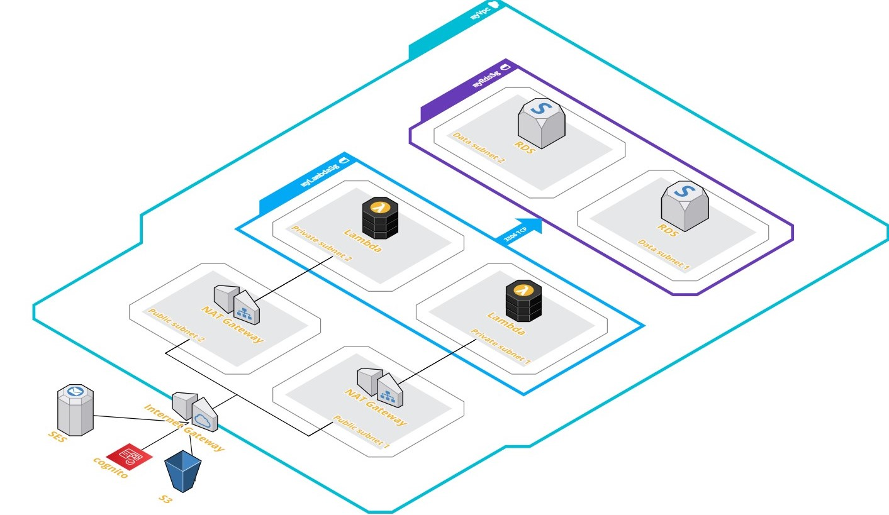

# AWS serverless architecture

This is the documentation of a serverless sample architecture, with explanations about some of the maded decisions.
The idea is to have a guide to replicate this architecture but also the workflow used for develope it.

## General view



## Topics

- [Custom VPC](https://github.com/Mateo-RH/cdkServerless/blob/main/Docs/vpc/vpc.md)
- [S3 Bucket for private file storing](https://github.com/Mateo-RH/cdkServerless/blob/main/Docs/S3/s3.md)
- [Database with RDS Aurora Serverless Cluster](https://github.com/Mateo-RH/cdkServerless/blob/main/Docs/Rds/rds.md)
- [Api with Lambda Functions & API Gateway](https://github.com/Mateo-RH/cdkServerless/blob/main/Docs/Lambda%26ApiGW/lambda%26apigw.md)
- [Cognito User Pool and Google & Microsoft AD identity providers](https://github.com/Mateo-RH/cdkServerless/blob/main/Docs/Cognito/cognito.md)

## Important notes

If you want to follow this from scratch, then you first have to follow the next steps.

1. install NodeJS
2. install Serverless framework
3. install aws cli and configure it with your credentials
4. install cdk

`$ npm install -g aws-cdk`

4. create a new project

`$ mkdir sampleServerless && cd sampleServerless && cdk init --language typescript`

5. Open the project and modify the next files:

_bin/sample_serverless.ts_

```javascript
#!/usr/bin/env node
import 'source-map-support/register';
import * as cdk from '@aws-cdk/core';
import { SampleServerlessStack } from '../lib/sample_serverless-stack';

const defaultEnv: cdk.Environment = {
  account: cdk.Aws.ACCOUNT_ID,
  region: 'us-east-2',
};

const app = new cdk.App();
class ServerlessCdkStack extends cdk.Construct {
  constructor(scope: cdk.Construct, id: string, env: cdk.Environment) {
    super(scope, id);
    new SampleServerlessStack(this, 'SampleServerlessStack', { env });
  }
}

new ServerlessCdkStack(app, 'dev', defaultEnv);
```

_lib/sample_serverless.ts_

```javascript
import { Construct, Stack, StackProps } from '@aws-cdk/core';

export class SampleServerlessStack extends Stack {
  constructor(scope: Construct, id: string, props: StackProps) {
    super(scope, id, props);

    // The code that defines your stack goes here
  }
}
```

_test/sample_serverless.ts_

```javascript
import {
  expect as expectCDK,
  matchTemplate,
  MatchStyle,
} from '@aws-cdk/assert';
import * as cdk from '@aws-cdk/core';
import * as SampleServerless from '../lib/sample_serverless-stack';

test('Empty Stack', () => {
  const app = new cdk.App();
  // WHEN
  const stack = new SampleServerless.SampleServerlessStack(app, 'MyTestStack', {
    env: {
      region: process.env.region,
      account: process.env.account,
    },
  });
  // THEN
  expectCDK(stack).to(
    matchTemplate(
      {
        Resources: {},
      },
      MatchStyle.EXACT
    )
  );
});
```
